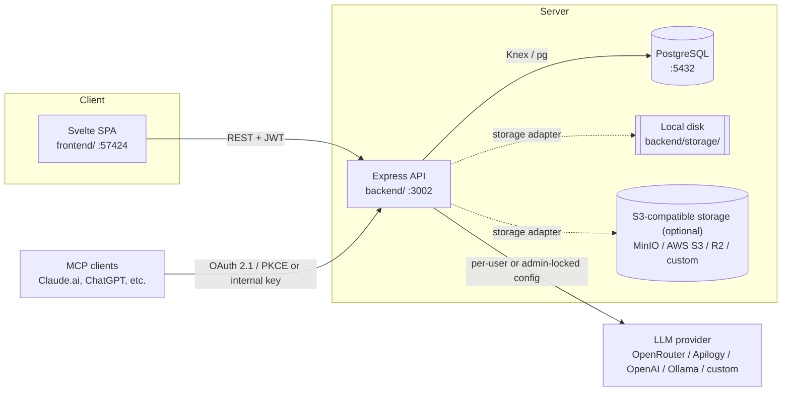

<div align="center">


# Self-hosted Second Brain

**Svaramind, fully self-hosted: your own notes app, your own database, your own rules.**

No DBaaS. No hosted auth provider. No cloud dependency in the critical path.
Just Postgres, Express, and Svelte, running wherever you want.

[Quick Start](#quick-start) · [Features](#features) · [Architecture](#architecture) · [Configuration](#configuration) · [Security](#security)

</div>

---

## Why this exists

Svaramind is an AI-native notes app: rich-text editing, a knowledge graph,
semantic search, voice capture, and a chat assistant that reads and writes
your notes. The hosted version is built for a multi-tenant SaaS, backed by a
DBaaS layer for auth, database access, and file storage.

This is that same app, repackaged to run entirely on infrastructure you
control. The DBaaS layer is gone. The backend talks straight to Postgres.
Auth is bcrypt + JWT, owned end to end. Storage is a pluggable adapter with
five backends to choose from. Every AI feature keeps working, including a
first-class local LLM option via Ollama, so nothing has to leave your network
if you don't want it to.

## Features

- **Full notes app**: workspaces, nested folders, rich-text editor (TipTap), tags, comments, version history, templates, to-dos, backlinks/wikilinks, a personal blog view
- **AI-native**: summarization, entity/action-item extraction, semantic search and RAG over your own notes, presentation/diagram/Instagram-post generation, an agentic chat assistant with tool calling
- **MCP server built in**: connect Claude.ai, ChatGPT, or any MCP client to your notes via OAuth 2.1 + PKCE, or via a trusted internal service key
- **Own your auth**: email/password with bcrypt + JWT, first signup becomes admin automatically, no third-party identity provider
- **Storage, your choice**: local filesystem, MinIO, AWS S3, Cloudflare R2, or any other S3-compatible store, switchable at runtime from the Admin console, no restart or redeploy needed
- **Five LLM providers, one of them fully local**: OpenRouter, Apilogy (Telkom AI), OpenAI, Ollama, or any custom OpenAI-compatible endpoint
- **Admin console**: manage every user (create, disable, delete), and optionally lock the whole organization onto a single default model for chat, embeddings, and transcription, with per-category locks so users keep bring-your-own-key flexibility wherever you don't need to enforce a default
- **Application-layer authorization**: every document/folder/workspace access is checked in code (see [`authz.js`](backend/src/services/authz.js)), not delegated to a database feature that silently doesn't apply

## Architecture



Nothing here calls out to `*.yesvara.com` or Google, except:
- whichever LLM provider you configure (and if that's Ollama, not even that)
- whichever storage provider you configure, if it's a remote S3-compatible store
- Google Custom Search, only if you enable the AI web-search feature

| Component | Tech | Port |
|---|---|---|
| `frontend/` | Svelte 4 + Vite + TipTap | 57424 (configurable via `FRONTEND_PORT`) |
| `backend/` | Node.js + Express 5 + Knex | 3002 |
| Postgres | 16 (Alpine) | 5432 |
| MinIO (optional, local S3-compatible testing) | S3-compatible object storage | 9000 / 9001 |

## Quick Start

Requires Docker, Node.js 20+, and `openssl`.

```bash
git clone <this-repo> && cd svaramind-local

# 1. Database
docker compose up -d postgres

# 2. Backend
cd backend
cp .env.example .env
# fill in JWT_SECRET, MCP_OAUTH_JWT_SECRET, NOTES_ENCRYPTION_KEY - see below
npm install
npm run migrate
npm run dev &          # http://localhost:3002

# 3. Frontend
cd ../frontend
cp .env.example .env
npm install
npm run dev             # http://localhost:57424 (set FRONTEND_PORT in .env to change it)
```

Generate the required secrets:

```bash
openssl rand -base64 64   # JWT_SECRET
openssl rand -base64 64   # MCP_OAUTH_JWT_SECRET
openssl rand -base64 32   # NOTES_ENCRYPTION_KEY
```

Open http://localhost:57424 and sign up. The first account created
automatically becomes an admin. From the user menu, an "Admin" link takes
you to the console: storage, users, and default AI models.

To create/promote an admin from the CLI instead:

```bash
cd backend && node src/scripts/createAdmin.js you@example.com yourpassword
```

## Configuration

All backend config lives in `backend/.env` (see `backend/.env.example` for the full template):

| Variable | Required | Notes |
|---|---|---|
| `DATABASE_URL` | yes | Postgres connection string |
| `JWT_SECRET` | yes | Signs user session tokens |
| `NOTES_ENCRYPTION_KEY` | recommended | AES-256-GCM field-level encryption at rest for note content |
| `MCP_OAUTH_JWT_SECRET` | yes, if using MCP | Signs MCP access tokens |
| `MCP_OAUTH_ISSUER` | no | Public URL of this backend, used in OAuth discovery metadata |
| `SVARAMIND_INTERNAL_KEY` | no | Shared secret for trusted internal service-to-service MCP calls |
| `OPENROUTER_API_KEY` | no | Optional org-wide fallback LLM key |
| `GOOGLE_SEARCH_API_KEY` / `GOOGLE_SEARCH_CX` | no | Only needed for the AI web-search feature |
| `CORS_ORIGIN` | no | Extra allowed origins beyond `localhost:57424`/`:5173` |

Frontend config (`frontend/.env`):

| Variable | Default |
|---|---|
| `VITE_API_URL` | `http://localhost:3002/api` |
| `FRONTEND_PORT` | `57424` |

### Storage: local disk or S3-compatible

Default is local disk (`backend/storage/`), served through an authenticated
proxy route, no extra service needed. Everything else is configured entirely
from the Admin console (Admin > Storage), no restart or redeploy needed:

| Provider | Notes |
|---|---|
| Local Filesystem | Default. Files stay on this server's disk. |
| MinIO | Self-hosted, S3-compatible. Good fit for staying fully on-prem. |
| AWS S3 | Real AWS S3, any region. |
| Cloudflare R2 | S3-compatible, no egress fees. |
| Custom | Any other S3-compatible store (Backblaze B2, SeaweedFS, Garage, etc.). |

To try MinIO locally:

```bash
docker compose --profile minio up -d minio
```

Then in the app: Admin > Storage > MinIO, endpoint `http://localhost:9000`,
credentials `minioadmin` / `minioadmin` (change these in `docker-compose.yml`
for anything beyond local testing).

### LLM providers

Configured per user in Settings > AI & LLM, or forced organization-wide from
the Admin console (Admin > Default AI Models), with independent lock
switches for chat, embeddings, and transcription:

| Provider | Requires internet | API key |
|---|---|---|
| OpenRouter | yes | required |
| Apilogy (Telkom AI) | yes | required |
| OpenAI | yes | required |
| Ollama (local) | no | not required |
| Custom (OpenAI-compatible) | depends | depends |

For Ollama: install it (https://ollama.com), pull a chat model
(`ollama pull llama3.1`) and an embedding model (`ollama pull nomic-embed-text`),
then add it in Settings, or as the org-wide default in the Admin console.

## Security

- **Authorization is enforced in application code**, not via Postgres Row
  Level Security. The original hosted schema's RLS policies depended on the
  DBaaS layer injecting `request.jwt.claims` per request, a mechanism that
  doesn't exist here, so every document/folder/workspace/collaborator
  operation is explicitly checked in
  [`backend/src/services/authz.js`](backend/src/services/authz.js) and used
  throughout the controllers.
- **Ownership-check audit**: migrating off the old backend surfaced several
  endpoints that had no ownership check at all (they'd been silently relying
  on RLS that was never actually active, since the service role bypasses
  it). These were fixed as part of this rewrite, see the `authz.js` usage in
  `notesController.js`, `notesAIController.js`, and `mcpController.js`.
- **Field-level encryption at rest**: set `NOTES_ENCRYPTION_KEY` to encrypt
  note titles/content/text with AES-256-GCM before it touches the database.
- **File serving**: uploaded files are served through an authenticated proxy
  route (`GET /api/storage/file/*`, token via header or signed query param
  for `` tags), not a public static mount.
- **Passwords**: bcrypt, cost factor 10. Sessions are stateless JWTs (7-day
  default expiry, configurable via `JWT_EXPIRES_IN`).
- **CORS is an explicit allowlist, not a wildcard**: only `http://localhost:57424`
  (the default frontend port), `http://localhost:5173` (Vite's own default,
  kept as a fallback), and anything you add to `CORS_ORIGIN` are accepted.
  Any other origin is rejected outright, which is what allows the API to run
  with `credentials: true` safely (browsers refuse that combined with a
  wildcard origin). If you change `FRONTEND_PORT`, add the matching origin to
  `CORS_ORIGIN` in `backend/.env` or the frontend will be blocked. See
  [`backend/src/index.js`](backend/src/index.js).

## What's intentionally different from the hosted version

- No Google OAuth login: email/password only, to avoid an unnecessary
  external dependency in a closed-loop deployment.
- No "forgot password via email" flow (no SMTP configured). Logged-in users
  change their own password from Settings; admins can reset via
  `createAdmin.js` or directly in Postgres.
- Fresh database only: this does not migrate existing data from a hosted
  instance. That would be a separate, explicit export/import exercise.

## Project structure

```
svaramind-local/
├── docker-compose.yml       # Postgres (+ optional MinIO), backend
├── backend/
│   ├── src/
│   │   ├── controllers/     # Route handlers
│   │   ├── services/        # authz, encryption, storage adapters, AI/RAG
│   │   ├── middleware/      # JWT auth, admin gate
│   │   ├── db/migrations/   # Knex schema migrations
│   │   └── scripts/         # createAdmin.js
│   └── storage/             # Local file storage (gitignored)
└── frontend/
    └── src/
        ├── pages/            # Routes, incl. pages/admin/
        ├── components/       # Editor, sidebar, AI panels, etc.
        ├── lib/               # api.ts, auth.ts (backend client)
        └── stores/            # Svelte stores (auth, notes, settings)
```

## License

GNU General Public License v3.0 (GPLv3), see [LICENSE](LICENSE).

GPLv3 is a copyleft license. In practice that means:
- You are free to use, study, modify, and redistribute this software.
- If you distribute a modified version, it must also be licensed under GPLv3, and you must make the source code available to whoever you give the software to.
- If you run a modified version as a network service, GPLv3 itself does not require you to publish the source (that is what AGPLv3 is for), but you must still keep any GPLv3-covered code you redistribute under the same license.
- There is no warranty of any kind, as stated in the license text.
